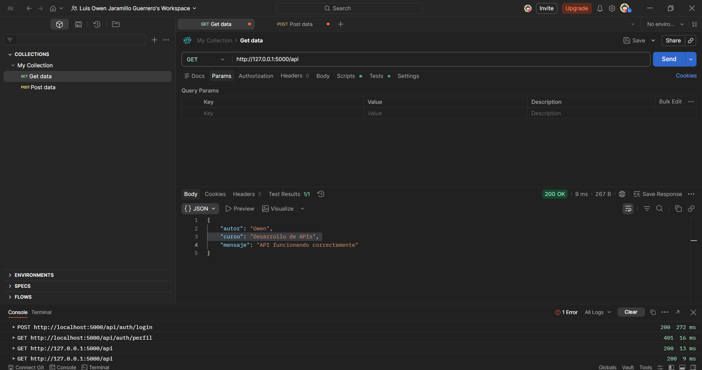

# Implementación de una API con Flask

## Descripción
En este proyecto desarrollé una **API básica utilizando el framework Flask en Python**, con el objetivo de comprender el funcionamiento de los servicios web y la estructura de una API REST.

La API incluye endpoints simples que permiten verificar que el servidor está funcionando correctamente y que puede responder con datos en formato **JSON**.

Este ejercicio forma parte de la práctica del curso **Desarrollo de APIs**, donde se busca aplicar los fundamentos de creación y consumo de servicios web.

---

## Tecnologías utilizadas

- Python
- Flask
- JSON
- Postman (para pruebas de la API)
- GitHub

---

## Estructura del proyecto

```
API_CRE/
│
├── app.py
├── .gitignore
├── README.md
└── pyvenv.cfg
```

---

## Código principal

El archivo principal de la aplicación es **app.py**, donde se definen los endpoints de la API.

```python
from flask import Flask, jsonify

app = Flask(__name__)

@app.route('/')
def inicio():
    return "Mi primera API con Flask"

@app.route('/api', methods=['GET'])
def api():
    return jsonify({
        "mensaje": "API funcionando correctamente",
        "autor": "Owen",
        "curso": "Desarrollo de APIs"
    })

if __name__ == '__main__':
    app.run(debug=True)
```

---

## Endpoints de la API

### 1. Ruta principal

**GET /**

Devuelve un mensaje simple para verificar que el servidor está funcionando.

**Respuesta:**

```
Mi primera API con Flask
```

---

### 2. Endpoint de la API

**GET /api**

Devuelve una respuesta en formato JSON.

**Respuesta:**

```json
{
  "mensaje": "API funcionando correctamente",
  "autor": "Owen",
  "curso": "Desarrollo de APIs"
}
```

---

## Pruebas con Postman

Para verificar el funcionamiento de la API se utilizó **Postman**, enviando una petición **GET** al endpoint `/api`.

### URL utilizada

```
http://127.0.0.1:5000/api
```

### Respuesta obtenida

```json
{
  "mensaje": "API funcionando correctamente",
  "autor": "Owen",
  "curso": "Desarrollo de APIs"
}
```

---

## Evidencia en Postman

Aquí se muestra la prueba realizada en Postman donde la API responde correctamente.



---

## Conclusión

En esta práctica desarrollé mi primera API utilizando Flask, lo que me permitió comprender cómo se crean endpoints y cómo se pueden devolver respuestas en formato JSON. Además, aprendí a probar servicios web utilizando Postman para verificar que las peticiones y respuestas funcionen correctamente.

Esta actividad es una base importante para el desarrollo de APIs más complejas que puedan conectarse con bases de datos y aplicaciones web.

---

## Autor

**Owen**  
